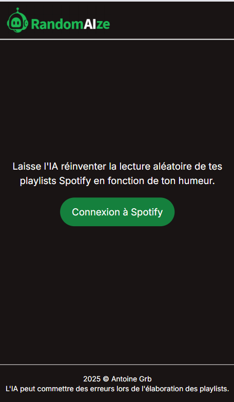
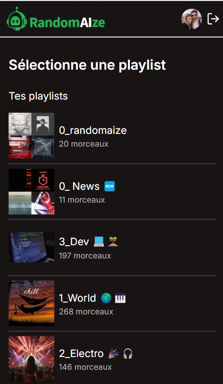
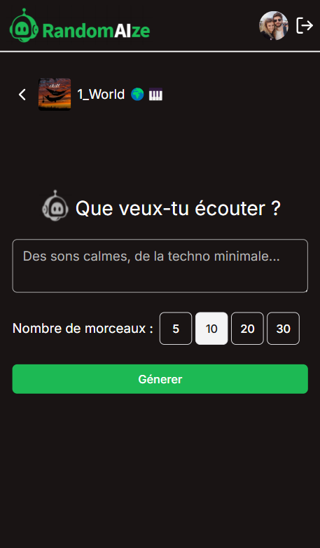

# RANDOMAIZE 🤖🎵

RANDOMAIZE est une application web qui vous permet de transformer vos playlists Spotify avec l'aide de l'IA, pour créer une expérience musicale unique et adaptée à vos envies.

[EDIT] : L'application est en dev mode, c'est à dire que les utilisateurs doivent être autorisés manuellement pour pouvoir se connecter.

---

## Présentation 🌟

L'objectif de RANDOMAIZE est de redéfinir la façon dont vous écoutez vos playlists. Plutôt que de laisser Spotify décider de l'ordre aléatoire, cette application utilise l'IA pour sélectionner et organiser les morceaux en fonction de vos envies du moment.

Que vous soyez d'humeur calme, énergique ou introspective, RANDOMAIZE génère une liste de lecture personnalisée à chaque utilisation. Son interface intuitive et son interaction fluide avec Spotify en font un outil pratique et amusant pour tous les mélomanes.

---

## Comment ça marche ? 📖

### 1. Connexion à Spotify

Dès votre arrivée sur l'application, connectez votre compte Spotify via le bouton de connexion. Cette étape permet à RANDOMAIZE d'accéder à vos playlists et d'interagir directement avec votre bibliothèque musicale.

_Connexion à Spotify_

### 2. Choix de la playlist

Une fois connecté, vous accédez à la liste de vos playlists Spotify. Sélectionnez celle que vous souhaitez utiliser avec RANDOMAIZE.

_Choix des playlists_

### 3. Prompt & génération de la liste de lecture

Sur la page de génération, entrez un prompt décrivant votre humeur ou vos besoins (par exemple : "des morceaux calmes pour étudier" ou "une playlist dynamique pour faire du sport").

RANDOMAIZE utilise l'IA pour analyser les morceaux de votre playlist et en sélectionner ceux qui correspondent le mieux à vos critères. Ces morceaux sont ensuite organisés pour une écoute fluide et agréable. La liste de lecture est ajoutée directement sur l'application Spotify active et le premier morceau de la liste se lance.

_Prompt et génération de la playlist_

---

## Technologies utilisées 🛠️

- **Frontend :**

  - Next.js 15
  - TailwindCSS pour un design moderne et réactif

- **Backend :**
  - Next.js 15 (server actions)
  - API Spotify (authentification, récupération des playlists, ajout à la file d'attente)
  - API OpenAI (pour analyser les morceaux et générer des sélections intelligentes)

---

## Auteur 👩‍💻

C'est moi ! 🚀 Passionné par le développement web, j'ai créé RANDOMAIZE pour allier musique et technologie. Si vous souhaitez en savoir plus, discuter de ce projet ou échanger des idées, n'hésitez pas à me suivre ou à m'envoyer un message. Je serai ravi de collaborer ou de répondre à vos questions.
